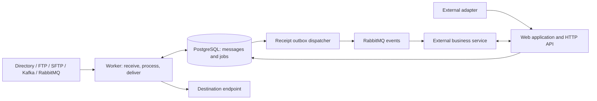

# M3 — Messaging Middleware

M3 receives messages, stores their original contents, applies configurable rules, and delivers results to other systems. Its web interface lets you configure connections, build message pipelines, inspect payloads, and investigate failed deliveries.

Use it to move files between directories or servers, connect Kafka and RabbitMQ to other endpoints, transform messages, or hand stored data to external business services through an HTTP API.

This repository builds **M3 Community**. It is a standalone Java application; the separate `m3-scale` repository is not required.

## Contents

- [What M3 does](#what-m3-does)
- [How it works](#how-it-works)
- [Quick start with Docker](#quick-start-with-docker)
- [Run locally for development](#run-locally-for-development)
- [Your first message flow](#your-first-message-flow)
- [Rules and processing](#rules-and-processing)
- [HTTP API](#http-api)
- [Configuration and access](#configuration-and-access)
- [Troubleshooting](#troubleshooting)
- [Development and tests](#development-and-tests)
- [Detailed documentation](#detailed-documentation)
- [Community, Scale, and licensing](#community-scale-and-licensing)

## What M3 does

| Capability | Description |
| --- | --- |
| Receive and send | Built-in DIRECTORY, FTP, SFTP, Kafka, and RabbitMQ transports. External adapters can submit messages through the API. |
| Store reliably | Persist payloads, metadata, and execution jobs in PostgreSQL before acknowledging reception. |
| Configure visually | Connect a source, conditions, filters, transformations, metadata additions, and a destination in the rule editor. |
| Track execution | Inspect jobs, attempts, errors, message history, original/copy links, and delivery status. |
| Integrate business services | Publish receipt events to RabbitMQ; services fetch messages and report processing status through the API. |
| Operate the installation | Monitor queues, worker availability, overdue processing, storage pressure, and audit records. |
| Control payload access | Mask sensitive fields by default and restrict access to original bytes. Optional S3/MinIO archival keeps the message catalog available. |

The interface supports English, Russian, German, French, Italian, and Portuguese. Choose a language at the bottom of the navigation rail; save open forms before changing it.

## How it works

Three concepts explain most of the application:

- **Channel:** an endpoint, such as a directory, an SFTP server, a Kafka topic, or a RabbitMQ queue. It owns connection settings and has an inbound or outbound direction.
- **Rule:** a pipeline that selects a source or destination and defines loading, conditions, and processing steps. Each rule belongs to a worker pool.
- **Worker:** a separate process that loads data from native sources, executes rule jobs, and sends messages. The web application manages configuration and exposes the API.

**Creating a channel does not start reception.** Enable an INBOUND rule for that channel and run a worker in the rule's pool.



PostgreSQL stores the durable job queue. RabbitMQ carries receipt and business-processing events. Receipt events contain a message ID and API path; a consumer fetches the stored message separately.

The UI and worker use the same JAR or Docker image, with different Spring profiles. Workers continue running when the UI stops, although the HTTP API is unavailable until the UI returns.

## Quick start with Docker

You need Docker Engine with Docker Compose and Linux container support. On Windows, use Docker Desktop in Linux container mode. Run commands from the repository root. The examples below use **PowerShell 7** (`pwsh`).

### 1. Create private configuration

For a **new installation**, generate an admin password and an encryption key in `.env`:

```powershell
if (Test-Path -LiteralPath .env) { throw '.env already exists; use its saved settings.' }
$adminPassword = [Convert]::ToBase64String([Security.Cryptography.RandomNumberGenerator]::GetBytes(24))
$secretKey = [Convert]::ToBase64String([Security.Cryptography.RandomNumberGenerator]::GetBytes(32))
@("M3_ADMIN_PASSWORD=$adminPassword", "M3_SECRET_KEY=$secretKey") |
    Set-Content -LiteralPath .env -Encoding utf8
```

The username is `admin`; its password is the `M3_ADMIN_PASSWORD` value in `.env`. Keep this file private. It is excluded from Git.

**Back up `M3_SECRET_KEY` alongside your installation backups.** It encrypts connection settings and job snapshots. An existing database requires its original key; generating a replacement prevents reading encrypted data.

Compose requires these variables even when starting only database and broker services. The `.m3/local-security.properties` file used by local Java runs does not populate Compose variables.

### 2. Build and start

```powershell
docker compose up --build -d
docker compose ps
docker compose logs --tail 100 app
```

Open [M3 at localhost:8080](http://localhost:8080) and sign in as `admin`.

Compose starts PostgreSQL, RabbitMQ, a restricted Docker API proxy, and the web application. The application applies database migrations, creates the `default` pool, and manages its worker container through the proxy. Worker containers are created dynamically and are not separate Compose services. Check **Administration → Workers** for availability.

The first build downloads Maven dependencies and builds the Vaadin frontend, so it may take several minutes.

| Service | Default address | Local development credentials |
| --- | --- | --- |
| M3 | [localhost:8080](http://localhost:8080) | `admin` / generated password |
| PostgreSQL | `localhost:5432`, database `m3` | `postgres` / `password` |
| RabbitMQ AMQP | `localhost:5672` | `m3` / `m3` |
| RabbitMQ management | [localhost:15672](http://localhost:15672) | `m3` / `m3` |

The database and broker credentials above are development defaults. Set `POSTGRES_PASSWORD` and `RABBITMQ_PASSWORD` in `.env` before a production installation, and serve M3 through HTTPS.

### 3. Stop or update

Managed workers can outlive the web application. Before shutting down the complete installation, set the pool's target container count to **0** in **Administration → Workers**, wait for the workers to stop, then run:

```powershell
docker compose down
```

Normal shutdown preserves the `postgres_data`, `rabbitmq_data`, and `message_files` volumes. `docker compose down --volumes` deletes these volumes, including stored messages and files.

For an update, back up first, stop old workers, then rebuild and start the upgraded application with `docker compose up --build -d`. It applies migrations before upgraded workers use the schema. Restore the pool target afterward. See [database migrations](docs/database-migrations.md) and [backup and restore](docs/backup-restore.md).

## Run locally for development

You need **JDK 21**, PowerShell 7 for the scripts, and PostgreSQL and RabbitMQ. The Maven wrapper is included; no separate Maven installation is required. Docker is useful for dependencies and integration tests.

The following is an alternative to the complete Docker stack for a **new local installation**. Do not run its UI alongside a Compose UI on the same port. If reusing an existing database, preserve its encryption key and credentials rather than initializing new ones.

### 1. Initialize credentials and start dependencies

```powershell
pwsh -File scripts/Initialize-LocalSecurity.ps1
$localSecurity = Get-Content -Raw .m3/local-security.properties | ConvertFrom-StringData
$env:M3_ADMIN_PASSWORD = $localSecurity['m3.security.admin-password']
$env:M3_SECRET_KEY = $localSecurity['m3.secret-key']
docker compose up -d db rabbitmq
```

The initialization script creates private credentials for `admin`, `operator`, and `viewer` and does not overwrite an existing file. The two environment assignments satisfy Compose's required settings. Local Java processes read `.m3/local-security.properties` from the repository root.

### 2. Build and start the web application

```powershell
.\mvnw.cmd package
.\scripts\run-app.ps1
```

Open [localhost:8080](http://localhost:8080). Passwords are stored in `.m3/local-security.properties`.

The build produces `target/m3-community.jar`. To build without running tests, use `.\mvnw.cmd package -DskipTests`.

### 3. Start a worker in another terminal

After the UI finishes its database migrations, open another terminal at the repository root:

```powershell
.\scripts\run-worker.ps1 -Pool default
```

Keep both processes running. The worker's pool name must match the rule's **Worker Pool**. The local UI does not create Docker workers unless Docker management is explicitly configured.

On Linux/macOS, initialize equivalent credentials through environment variables or the local properties file, then use:

```bash
./mvnw package
java -jar target/m3-community.jar --vaadin.launch-browser=false
# In a second terminal, after migrations finish:
java -jar target/m3-community.jar --spring.profiles.active=worker --m3.worker.pool=default
```

For IDE development, import `pom.xml`, select JDK 21, and run `com.sysadminanywhere.m3.Application` with the repository root as the working directory. Run a separate worker process as above.

## Your first message flow

Start with a directory-to-directory flow to verify loading, rule execution, and delivery without configuring another remote system.

1. **Create two directories in the worker's filesystem.** For a local Windows worker, use folders such as `D:\m3-data\in` and `D:\m3-data\out`. For Docker, use `/data/in` and `/data/out` in the shared `message_files` volume. After the Compose application starts, create them with:

   ```powershell
   docker compose exec app mkdir -p /data/in /data/out
   ```

2. **Create an inbound channel** under **Settings → Channels**. Name it `files-in`, select DIRECTORY and INBOUND, and set `directoryPath` to the input folder. Set the source charset to `UTF-8` for this text example.
3. **Create an outbound channel** named `files-out`, with DIRECTORY and OUTBOUND, pointing to the output folder.
4. **Create an INBOUND rule** under **Settings → Rules**. Choose `files-in` as the source, `files-out` as the destination, message body as the delivery format, and `default` as the worker pool. Leave conditions and transformations empty. Set the loading file pattern to `*.txt`, enable the rule, and save.
5. **Put a completed text file into the input folder.** For a local worker, create `hello.txt` containing `Hello from M3`. For Docker, the following creates it inside the mounted volume:

   ```powershell
   docker compose exec app sh -c 'printf "Hello from M3\n" > /data/in/.hello.tmp && mv /data/in/.hello.tmp /data/in/hello.txt'
   ```

6. **Inspect the result.** After a polling interval, the inbound list should contain the stored original and the outbound list should show its delivered copy as `SENT`. The output file is named `message-<id>-hello.txt`, where `<id>` is the outbound copy's ID.

The original inbound business status normally remains `LOADED`; successful routing does not mean an external service has processed it.

Directory polling defaults to five seconds and skips very recent or changing files. Keep source deletion disabled for the first test. M3 deduplicates retained files, so leaving the same file in place does not continually create new messages for the same rule.

**Paths belong to the worker.** A Docker worker cannot use a Windows `D:\...` path. Mount files and SFTP key/known-host files into containers and use their Linux paths. Input directories must already exist and be readable.

## Rules and processing

An INBOUND rule owns loading settings, including polling interval, file pattern, file deletion, Kafka consumer group, and initial message status. An OUTBOUND rule accepts explicitly submitted or forwarded messages and defines delivery. Each submission uses its selected `ruleId`; M3 does not automatically execute every rule for the channel.

The visual pipeline supports:

- Conditions on metadata, a top-level JSON field, or the whole body. AND takes precedence over OR in creation order.
- Filtering before transformations. If several filters exist, only the first configured filter is active.
- JSON field extraction, trim, uppercase/lowercase, literal replacement, prefix/suffix, and JSON serialization.
- Metadata additions and a destination receiving either the message body or its ID.

Transformations and metadata additions run in their saved order. Text transformations require a known source charset. For a JSON object, extract a string field before applying text operations. Original stored bytes are preserved.

**Preview entire rule** evaluates the saved pipeline against example text and metadata without storing messages or contacting endpoints. Canvas steps save immediately; channel, loading, and worker settings require **Save** on the rule.

There are separate kinds of status:

| Status | Meaning |
| --- | --- |
| Inbound business status | `LOADED`, `PROCESSING`, `PROCESSED`, or `PROCESSING_FAILED`; tracks work by business recipients. |
| Rule execution job | Tracks pipeline execution, attempts, scheduling, and errors independently of business processing. |
| Outbound message status | `PENDING`, `SENT`, or `FAILED`; tracks delivery to the destination. |

New jobs store an encrypted snapshot of rule steps and connection settings when accepted. Later edits affect new jobs; retries keep their original snapshot. Resubmit or forward a new copy to use updated configuration. Disabling a channel stops sending, and worker pool assignment remains operational.

**Uncertain delivery** means the receiver may have accepted a send before M3 could record its outcome. Automatic retries stop at this boundary. Check the receiver before acknowledging a manual retry; duplicate delivery remains possible. Kafka/RabbitMQ consumers should deduplicate using the stable `m3DeliveryId` header. See [outbound messages](docs/outbound-messages.md).

## HTTP API

API calls use **HTTP Basic authentication**. Every mutating request also needs **`X-M3-Request: 1`**. Browser session cookies do not authorize API calls.

| Endpoint | Purpose |
| --- | --- |
| `GET /api/v1/sources` | List inbound endpoints and availability. |
| `GET /api/v1/loading-rules` | Inspect loading rules and receiver states. |
| `POST /api/v1/channels/{channelId}/messages` | Store an inbound message using an enabled INBOUND `ruleId`. |
| `GET /api/v1/rules/outbound` | Find outbound rule IDs and pool assignments. |
| `POST /api/v1/messages/outbound` | Store a message and queue delivery through an OUTBOUND rule. |
| `GET /api/v1/messages/{id}` | Read message details and metadata. |
| `GET /api/v1/messages/{id}/payload` | Download the payload; masked by default. |
| `GET /api/v1/messages/{id}/jobs` | Inspect rule execution jobs. |
| `GET /api/v1/messages/{id}/delivery` | Inspect outbound delivery attempts. |
| `POST /api/v1/messages/{id}/retry` | Retry failed jobs; uncertain delivery requires explicit acknowledgement. |
| `POST /api/v1/messages/{id}/forward` | Create a copy for an outbound rule. |
| `GET /api/v1/messages/{id}/processing` | Read recipient processing attempts and versions. |
| `PATCH /api/v1/messages/{id}/processing/{recipient}/status` | Report business-processing progress with attempt/version checks. |

### Example: submit an outbound message

First create and enable an OUTBOUND rule with a destination and the `default` pool. Find its ID through the UI or `GET /api/v1/rules/outbound`. Save this as `outbound.json`, replacing `12` with that rule's ID:

```json
{
  "ruleId": 12,
  "payload": "Hello from the API",
  "payloadType": "text/plain",
  "charset": "UTF-8",
  "metadata": {
    "fileName": "hello.txt",
    "externalId": "demo-001"
  }
}
```

In PowerShell, run the following; curl prompts for the admin password:

```powershell
curl.exe --user admin --header "X-M3-Request: 1" --header "Content-Type: application/json" --header "Idempotency-Key: demo-001" --data-binary "@outbound.json" http://localhost:8080/api/v1/messages/outbound
```

On Linux/macOS, use `curl` instead of `curl.exe`. A `202 Accepted` response means the payload and job have been committed, with the stored ID in the response. Delivery happens asynchronously. Read `GET /api/v1/messages/{id}/delivery` to check its outcome.

Repeating an identical submission with the same `Idempotency-Key` returns the original message ID. Reusing the key for different request data returns `409 Conflict`. Use a new key for a new message.

Original-byte reads require original-payload permission and `?original=true`, for example `/api/v1/messages/{id}/payload?original=true`. By default, only `admin` has this access.

For receipt subscriptions, inbound submission, binary payloads, and versioned business callbacks, see the [ingestion API](docs/message-ingestion.md), [outbound API](docs/outbound-messages.md), and [external processing contract](docs/external-processing-operations.md).

## Configuration and access

Java defaults are in [`application.properties`](src/main/resources/application.properties); worker overrides are in [`application-worker.properties`](src/main/resources/application-worker.properties). Local scripts run from the repository root so the private security file is found. Docker reads configuration through [`compose.yaml`](compose.yaml) and `.env`.

| Setting | Purpose |
| --- | --- |
| `M3_ADMIN_PASSWORD` | Required admin password, 16–72 UTF-8 bytes. |
| `M3_OPERATOR_PASSWORD`, `M3_VIEWER_PASSWORD` | Optional passwords enabling those accounts, with the same length requirement. |
| `M3_SECRET_KEY` | Persistent Base64 encoding of 32 random bytes for AES-256-GCM encryption. |
| `SPRING_DATASOURCE_URL`, `SPRING_DATASOURCE_USERNAME`, `SPRING_DATASOURCE_PASSWORD` | Database connection for local Java processes. |
| `M3_BROKER_RABBIT_HOST`, `M3_BROKER_RABBIT_PORT`, `M3_BROKER_RABBIT_USERNAME`, `M3_BROKER_RABBIT_PASSWORD` | Event broker connection for Java processes. |
| `M3_WORKER_POOL` | Standalone worker's pool; default `default`. |
| `M3_OUTBOUND_MAX_ATTEMPTS` | Delivery attempt limit; default `20`. |
| `M3_STORAGE_MODE` | Default `KEEP`; optional `ARCHIVE` or `DELETE` policies require deliberate configuration. |
| `M3_RETENTION_MESSAGES_DAYS`, `M3_RETENTION_IDEMPOTENCY_DAYS` | Default `0`, retaining business messages and deduplication keys indefinitely. |
| `M3_RETENTION_RECEIPTS_DAYS`, `M3_RETENTION_AUDIT_DAYS` | Published receipt retention defaults to `30` days; audit retention to `365`. |

Compose uses `POSTGRES_DB`, `POSTGRES_USER`, `POSTGRES_PASSWORD`, and `POSTGRES_PORT` for PostgreSQL; `RABBITMQ_USER`, `RABBITMQ_PASSWORD`, and `RABBITMQ_PORT` for RabbitMQ; and `M3_PORT` for the web port. These are mapped to the application's container settings. If local Java processes connect to changed Compose ports or credentials, set the corresponding datasource/broker variables in **both** UI and worker terminals or IDE configurations.

| Account | Access |
| --- | --- |
| `admin` | Configuration, worker management, message operations, audit, and original payload access by default. |
| `operator` | Submit, forward, retry, and delete eligible messages; report business status. |
| `viewer` | Read messages and monitoring. |

Blank secret fields in channel forms retain the saved value. Removing an extra-property row removes that property. Audit records store actors and operations without payloads or credentials. External services can use scoped machine accounts; see [processing and operations](docs/external-processing-operations.md).

Automatic cleanup preserves active work and unpublished events. Configure archival, deletion, masking, and quotas using [storage and troubleshooting documentation](docs/troubleshooting-storage-scale.md), and use the [consistent backup procedure](docs/backup-restore.md) before upgrades.

## Troubleshooting

| Symptom | What to check |
| --- | --- |
| Compose reports a missing admin password or encryption key | Create `.env` with `M3_ADMIN_PASSWORD` and `M3_SECRET_KEY`, or provide them in the current environment. |
| UI is available but no files are loaded | Enable an INBOUND rule, save its pool assignment, and start a worker in that pool. A channel alone is idle. |
| Receiver shows `NO_WORKER` or `STALE` | Check **Administration → Workers**, the worker process/container, and its database connection. Heartbeats prove process liveness, not transport health. |
| Files are invisible to a Docker worker | Use mounted Linux paths such as `/data/in`, and check directory permissions, file pattern, and minimum file age. |
| Message is saved but receipt events are pending | Check RabbitMQ connectivity. The transactional outbox retains events and retries publication. |
| Inbound status remains `LOADED` after delivery | This is business-processing status. Inspect rule jobs and the outbound copy; external services report processing separately. |
| API returns `401` or `403` | Supply Basic credentials, an authorized role, and `X-M3-Request: 1` for mutations. |
| Text transformation fails | Declare the source charset. Extract a string field before text transformations on JSON objects. |
| Retry still uses old settings | Accepted jobs keep their snapshots. Create a new submission or forward a copy to apply current settings. |
| Delivery is uncertain | Check the receiving system before acknowledging a retry. |
| Startup cannot decrypt settings | Restore the installation's original encryption key. |

For Docker logs, use `docker compose logs --tail 100 app` and inspect the managed worker container shown on the Workers page with `docker logs <container-name>`.

## Development and tests

Stack: **Java 21**, **Spring Boot 4.0.6**, **Spring Integration 7.0.4**, **Vaadin 25.1.3**, **PostgreSQL**, **Liquibase**, and **Maven**.

```text
src/main/java/com/sysadminanywhere/m3/
  Application.java       Application entry point
  base/                  Shared UI, security, persistence, and translations
  community/             Fixed Community execution policy and API boundary
  extensions/            Shared extension contracts
  messaging/
    api/                 HTTP endpoints
    domain/              Messages, channels, rules, jobs, and enums
    repository/          JPA repositories
    service/             Rule engine, storage, processing, and operations
    source/              Native inbound receivers
    outbound/            Durable delivery workers and transports
    broker/              Receipt and processing-event publication
    worker/              Scheduling, leases, execution slots, and heartbeats
    ui/                  Vaadin views and pipeline editor
    integration/         Shared JSON configuration and message gateway
src/main/resources/      Application settings, translations, and migrations
src/test/                Java and JavaScript tests
browser-tests/           Browser regression checks
scripts/                 Local launch, backup, restore, and distribution tools
docs/                    Detailed contracts and operational guides
```

Run Java and JavaScript checks from the repository root:

```powershell
.\mvnw.cmd test
node --test src/test/js/*.test.cjs
```

Java integration tests use isolated PostgreSQL, RabbitMQ, and Kafka containers and embedded file-transfer servers. Run with Docker available for integration coverage; container-based tests can be skipped when Docker is unavailable.

Browser checks need Chrome and a running test instance:

```powershell
npm --prefix browser-tests ci
npm --prefix browser-tests test
```

Set `M3_TEST_URL` for a separate instance. Test credentials come from environment variables or the ignored local credentials file. Use isolated installations for tests that mutate configuration or perform transport I/O. See [distribution checks](docs/code-distribution.md) for package verification and clean source export.

## Detailed documentation

| Guide | Covers |
| --- | --- |
| [Message ingestion](docs/message-ingestion.md) | Receivers, loading settings, acknowledgement, deduplication, HTTP submission, and receipt events. |
| [Outbound messages](docs/outbound-messages.md) | Destinations, delivery jobs, payload modes, retries, and forwarding. |
| [Payload encodings](docs/message-encodings.md) | Original bytes, charsets, Base64 requests, previews, and transformations. |
| [External processing and operations](docs/external-processing-operations.md) | Recipient attempts, callback versions, replay, deadlines, events, and quotas. |
| [Troubleshooting, storage, and Scale](docs/troubleshooting-storage-scale.md) | Search, masking, history, S3/MinIO, storage policies, and full-distribution features. |
| [Database migrations](docs/database-migrations.md) | Liquibase, upgrade order, adopting compatible existing schemas, and migration tests. |
| [Backup and restore](docs/backup-restore.md) | Consistent database, payload, and encryption-key backups. |
| [Build and distribution](docs/code-distribution.md) | Independent Community/Scale builds, IDE setup, packaging, and source export. |
| [Licensing documents](docs/licenses/README.md) | Draft agreements and distribution terms. |

## Community, Scale, and licensing

Community supports **one worker pool and one execution slot**, with no autoscaling. It contains no Scale license verifier or activation API. Its output is `target/m3-community.jar`, and its Docker image is `m3:community`.

Scale is built separately from `m3-scale` using matching Community source. Its full distribution can run in Community mode; a signed entitlement enables purchased capacity, multiple pools, and autoscaling. External-authentication entitlement checks exist in the full distribution, while Keycloak/AD connectors are a separate implementation stage. See [build and distribution](docs/code-distribution.md).

The proposed licensing model allows free Community installation and internal business use, with restrictions on code modification and redistribution of customer builds. **The agreements are drafts for first publication** and still require rights-holder and release details. This README summarizes that proposed model; [LICENSE.md](LICENSE.md) and the [license agreements](docs/licenses/README.md) describe its status and terms. Third-party components retain their own licenses.
