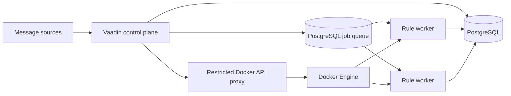

# M3 runtime architecture

## Runtime layout

M3 has a control plane and independently scalable rule workers. The Vaadin application remains the control plane: it edits channels and rules, displays message history, manages worker capacity, and changes rule assignments. It does not evaluate rules.

## Responsibilities

### Vaadin control plane

- Owns channel, rule, worker-pool, assignment, and capacity settings.
- Accepts or configures message sources, persists each inbound message, and creates one durable job for each assigned rule.
- Shows messages, worker health/load, and rule-to-worker assignments.
- Starts, stops, and scales worker containers through a restricted Docker API proxy.
- Persists control-plane state in PostgreSQL.

### Rule workers

- Run without the Vaadin web interface.
- Register a stable worker identity and report health/load.
- Claim jobs from PostgreSQL using `FOR UPDATE SKIP LOCKED` and execute only the rules assigned to their worker pool.
- Persist execution results and message status in PostgreSQL.
- Commit the rule result and message status in the same transaction as the job completion.

### PostgreSQL work queue

- PostgreSQL is the source of truth for rule definitions, assignments, worker desired state, message history, and execution status.
- The job table buffers incoming work durably and distributes it across replicas of a worker pool through row-level locking and `SKIP LOCKED`.
- A worker lease returns unfinished work to `PENDING` after a container disappears.
- Rule assignment changes move pending jobs to the new pool. A job already claimed keeps running to completion in its original worker.

### Container management

- Worker pools have desired replica count and scaling limits configured through the Vaadin UI.
- The control plane reconciles desired and running containers through a Docker API proxy with only the container operations it needs enabled.
- The Docker socket is never mounted directly into the Vaadin application container.
- Docker Compose starts the control plane, database, and restricted Docker API proxy. The control plane reconciles worker containers against the Docker Engine API; Compose itself is not treated as a runtime orchestration API.

## Rule assignment and movement

Each rule belongs to one worker pool. The UI can move it through the rule detail page. Jobs that have not started move immediately; a job already claimed finishes in its original worker. Once all rule jobs for a message finish, the last worker combines the matches in priority order and creates the routed outbound message, preserving the existing priority-based rule behavior.

## Implemented migration

Inbound messages are now persisted by the control plane and expanded into one durable `RuleExecutionJob` per enabled rule. Worker containers use the same image with the `worker` profile, which disables Vaadin/Hilla and the inbound adapters. They claim jobs from PostgreSQL and run condition evaluation; the final worker applies the matched rules' filters, transformations, and routing in priority order.

The Vaadin Workers page stores a fixed target or queue-based auto-scaling settings, minimum/maximum replica counts, and a pending-job threshold per worker. Auto-scaling uses pending plus currently processing jobs; the Docker API reconciler creates/removes containers for each pool and retries desired state every 30 seconds. The page reports running containers and pool queue depth. Rule detail now has a worker-pool selector, and the rule list shows each assignment.

The worker lease is five minutes by default. Failed rule executions mark the inbound message failed and remain visible as failed jobs. Auto-scaling is currently driven by queue depth; CPU/latency-based policies and worker heartbeat health are not part of this first pass.
